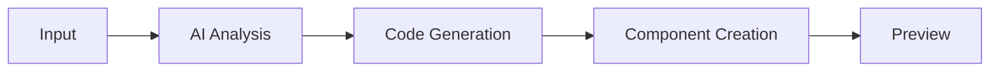

<!-- Header with Logo and Title -->
<div align="center">
  <h1>🎨 AI Code Generator</h1>
  <p>Transform your ideas into production-ready code with AI-powered magic</p>
  
  [](LICENSE)
  [](https://reactjs.org/)
  [](https://www.typescriptlang.org/)
  [](https://tailwindcss.com/)
  [](https://github.com/aryan1112003)
</div>

## 🌟 Overview

AI Code Generator is a revolutionary tool that transforms natural language descriptions into beautiful, production-ready frontend code. Whether you're a developer looking to prototype quickly or a designer wanting to bring your ideas to life, our AI-powered platform has got you covered.

## ✨ Features

- 🤖 **AI-Powered Code Generation**
  - Natural language to code conversion
  - Smart context understanding
  - Multiple component generation
  
- 🎨 **Creative Design System**
  - Modern UI components
  - Responsive layouts
  - Custom animations
  
- 🔄 **Development Workflow**
  - Real-time preview
  - Code editing
  - Instant feedback
  
- 🛡️ **Production Ready**
  - Clean, maintainable code
  - Best practices
  - Performance optimized

## 🚀 Getting Started

### Prerequisites

- Node.js 18+
- npm or yarn
- OpenAI API key

### Installation

1. Clone the repository
   ```bash
   git clone https://github.com/aryan1112003/ai-code-generator.git
   cd ai-code-generator
   ```

2. Install dependencies
   ```bash
   npm install
   ```

3. Configure environment
   ```bash
   cp .env.example .env
   # Add your OpenAI API key to .env
   ```

4. Start development server
   ```bash
   npm run dev
   ```

## 🔄 Workflow

### 1. Design Description
```plaintext
Enter your design requirements in natural language:
"Create a modern landing page with a hero section,
animated features grid, and a contact form"
```

### 2. AI Processing


### 3. Code Generation
- HTML structure
- Tailwind CSS styling
- React components
- Interactive elements

### 4. Preview & Edit
- Real-time preview
- Code modifications
- Instant updates

## 🏗️ Architecture

```plaintext
src/
├── components/         # Reusable UI components
├── context/           # React context providers
├── pages/             # Main application pages
├── services/          # API and external services
├── types/             # TypeScript definitions
└── utils/             # Helper functions
```

## 💡 Usage Examples

### Basic Component
```typescript
// Generate a simple card component
"Create a card component with image, title, and description"
```

### Complex Layout
```typescript
// Generate a full landing page
"Design a SaaS landing page with pricing tables"
```

### Interactive Elements
```typescript
// Generate interactive components
"Create an animated dropdown menu"
```

## 🛠️ Tech Stack

- **Frontend Framework**: React 18 with TypeScript
- **Styling**: Tailwind CSS
- **Code Editor**: Monaco Editor
- **AI Integration**: OpenAI GPT-4
- **Icons**: Lucide React
- **Animations**: Framer Motion
- **Development**: Vite

## 🤝 Contributing

We welcome contributions! Here's how you can help:

1. Fork the repository
2. Create your feature branch
   ```bash
   git checkout -b feature/amazing-feature
   ```
3. Commit your changes
   ```bash
   git commit -m 'Add amazing feature'
   ```
4. Push to the branch
   ```bash
   git push origin feature/amazing-feature
   ```
5. Open a Pull Request

## 📜 License

Copyright © 2024 [Aryan Acharya](https://github.com/aryan1112003)

This project is licensed under the MIT License - see the [LICENSE](LICENSE) file for details.

## 👨‍💻 Author

**Aryan Acharya**
- GitHub: [@aryan1112003](https://github.com/aryan1112003)
- LinkedIn: [https://www.linkedin.com/in/aryan-acharya-9b939b316/]

  


## 🌟 Show your support

Give a ⭐️ if this project helped you!
